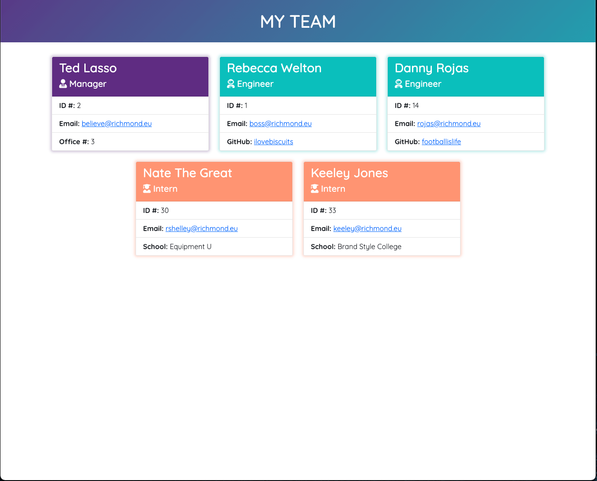
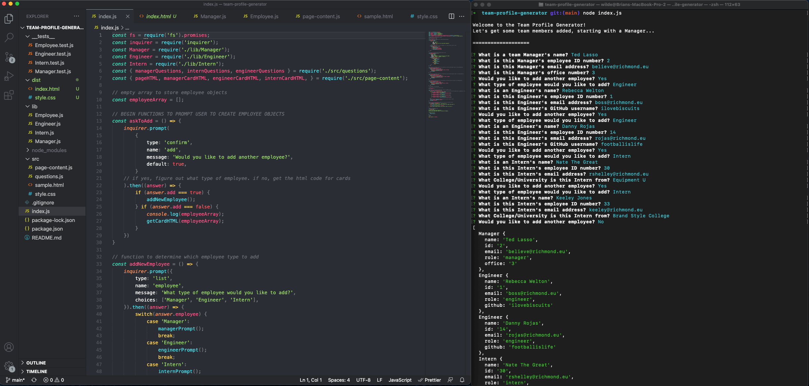
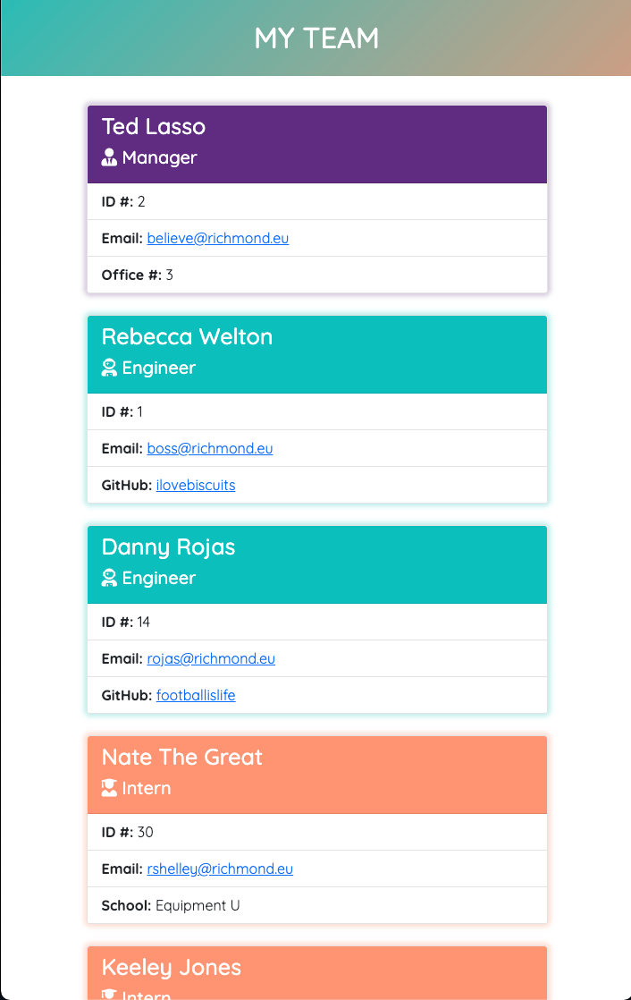

  # Team Profile Generator
  

  ## Description
  This application uses Node.js with object oriented programming fundamentals to interact with a user through the command line and generate a styled html page of members of a work team. This application uses inquirer for the prompt question, and tests using Jest were set up for this project as well. In the end, a user will have a clean looking (with bootstrap framework) html page to see information specific to their employees.  

  ## Table of Contents
  * [Installation](#installation)
  * [Usage](#usage)
  * [Credits](#credits)
  * [License](#license)
  * [Contributing](#contributing)
  * [Tests](#tests)
  * [Questions](#questions)
  
  ## Installation
  When you make a copy of this repo, run 'npm install' or 'npm i' in your command line to install dependencies required (fs, jest, inquirer).

  ## Usage
  1. In your command line, navigate to the root folder of this application. 
  2. Run the command 'node index.js' to initialize the Team Profile Generator. 
  3. Follow the series of prompts on the screen to add employees to the page. 
  4. When you choose not to add any more employees, you will see a listing of the employee details you submitted, followed by confirmation of the files created in the dist folder. 
  5. Copy BOTH of the newly created style.css and index.html pages from the dist folder to the desired folder for your usage, making sure they are in the same folder for the styles to work with the html page.

  ### Deployed link and Screenshots
  (no deployed application, runs through node on local machine)
  
  
  

  ## Credits
  the user guidelines and mockup for this project were given by Trilogy Education as a part of the University of Kansas Full Stack Web Developer Bootcamp. All coe is original. Found and adapted instructions for "moving" color gradient backgrounds in css from Julio Codes on youtube: https://www.youtube.com/watch?v=fBRzD6dwJfw.

  ## License
  
  
### MIT LICENSE

Permission is hereby granted, free of charge, to any person obtaining a copy
of this software and associated documentation files (the "Software"), to deal
in the Software without restriction, including without limitation the rights
to use, copy, modify, merge, publish, distribute, sublicense, and/or sell
copies of the Software, and to permit persons to whom the Software is
furnished to do so, subject to the following conditions:

The above copyright notice and this permission notice shall be included in all
copies or substantial portions of the Software.

THE SOFTWARE IS PROVIDED "AS IS", WITHOUT WARRANTY OF ANY KIND, EXPRESS OR
IMPLIED, INCLUDING BUT NOT LIMITED TO THE WARRANTIES OF MERCHANTABILITY,
FITNESS FOR A PARTICULAR PURPOSE AND NONINFRINGEMENT. IN NO EVENT SHALL THE
AUTHORS OR COPYRIGHT HOLDERS BE LIABLE FOR ANY CLAIM, DAMAGES OR OTHER
LIABILITY, WHETHER IN AN ACTION OF CONTRACT, TORT OR OTHERWISE, ARISING FROM,
OUT OF OR IN CONNECTION WITH THE SOFTWARE OR THE USE OR OTHER DEALINGS IN THE
SOFTWARE.

  ## Contributing
  No contributing guidelines currently

  ## Tests
  Run the command 'npm run test' to run tests on the object classes using Jest. 

  ## Questions
  You can find my GitHub profile at https://github.com/bgswilde
  For any further questions, reach out to me via email at bgswilde@gmail.com.
